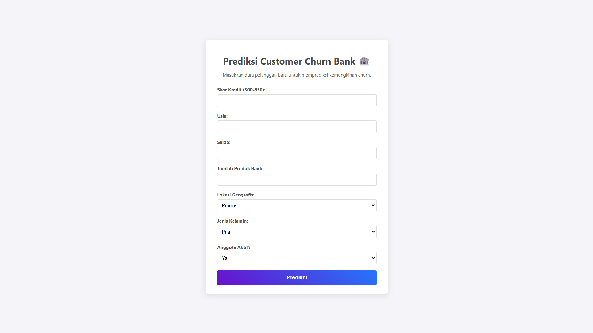

# 🧠 Customer Churn Prediction System  
### End-to-End Machine Learning Project with Deployment (Flask)


---

## 🚀 Project Overview

Customer churn merupakan salah satu masalah paling kritikal dalam industri perbankan. Kehilangan pelanggan berarti kehilangan revenue, peluang cross-selling, serta potensi pertumbuhan jangka panjang.

Project ini membangun **end-to-end machine learning system** untuk:
- 🔍 Memprediksi pelanggan yang berisiko churn  
- ⚡ Memberikan insight untuk strategi retensi  
- 🌐 Di-deploy sebagai aplikasi menggunakan Flask  

> 💡 Fokus utama: **dari analisis → model → deployment (real-world ready)**

---

## 🎯 Business Problem

- Cost akuisisi pelanggan baru: **5–25x lebih mahal**
- Tidak adanya sistem prediksi churn yang proaktif
- Retensi pelanggan masih bersifat reaktif

---

## 💡 Solution Approach

Pipeline yang dibangun dalam project ini:
Data → Preprocessing → EDA → Feature Engineering → Model Training → Evaluation → Deployment (Flask)

---

## 🧪 Exploratory Data Analysis (EDA)

Analisis dilakukan untuk memahami pola churn:

- Distribusi churn vs non-churn
- Korelasi antar fitur
- Perbedaan perilaku pelanggan

### 🔍 Key Insights:
- Usia menengah → lebih rentan churn  
- Saldo tinggi → indikasi potensi churn  
- >2 produk → risiko meningkat  
- Status tidak aktif → faktor signifikan  
- Lokasi (Jerman) → churn lebih tinggi  

---

## 🤖 Machine Learning Models

Beberapa model yang diuji:
- Logistic Regression
- Random Forest
- Support Vector Classifier (SVC)
- LightGBM

---

## 📊 Model Evaluation

Fokus evaluasi:
- **Recall (priority utama)**
- Precision
- F1-Score
- Accuracy

---

## 🏆 Final Model Recommendation

### 🥇 SVC (Primary Model)
- Recall: **0.77**
- Cocok untuk:
  - Mengidentifikasi sebanyak mungkin churn
  - Strategi retensi agresif

---

### ⚖️ LightGBM (Alternative)
- Precision tinggi & balanced
- Cocok untuk:
  - Efisiensi biaya kampanye
  - Menghindari false positive

---

## 🌐 Deployment (Flask App)

Model telah diimplementasikan dalam bentuk aplikasi web menggunakan Flask.

### ✨ Features:
- Input data pelanggan melalui form
- Prediksi churn secara real-time
- Output probabilitas churn

### ▶️ Run Locally:
```bash
git clone https://github.com/your-username/your-repo.git
cd your-repo
pip install -r requirements.txt
python app.py

📸 Application Preview
